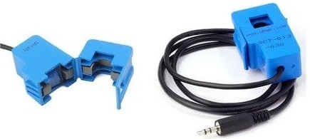
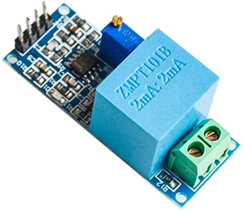
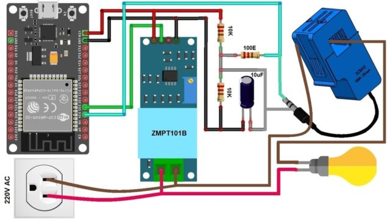
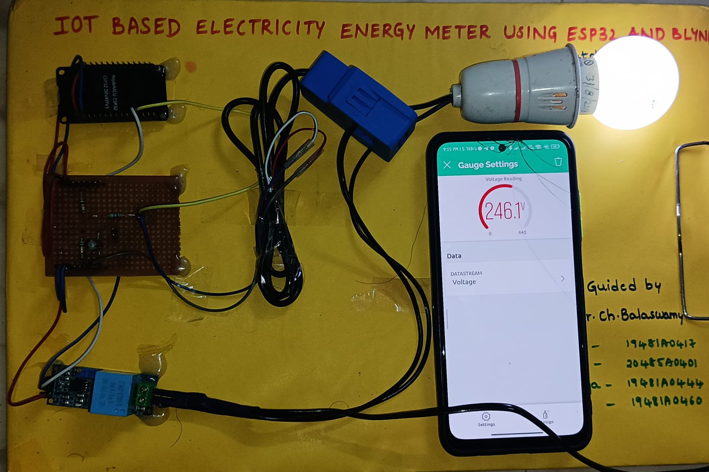
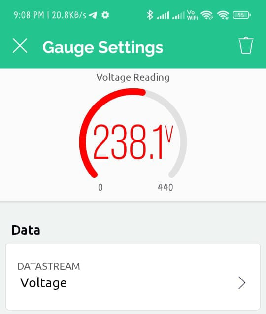
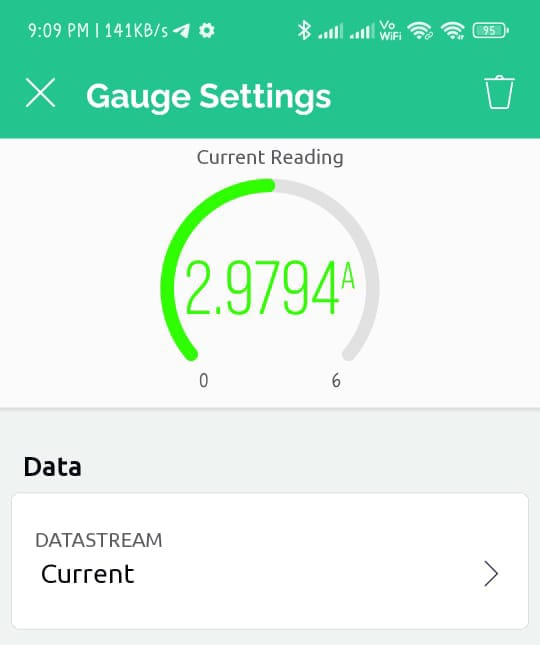
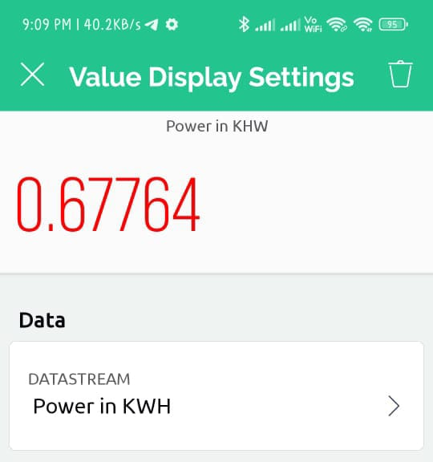

# IoT based Smart Electricity Meter using ESP32 by Wifi Protocol

In this project, we will learn how to make our own ***IoT Based Smart Electricity Energy Meter using ESP32*** & monitor data on the **Blynk Application**. With the current technology, you need to go to the meter reading room and take down readings. Thus monitoring and keeping track records of your electricity consumption is a tedious task. To automate this, we can use the Internet of Things. The Internet of Things saves time and money by automating remote data collection. Smart Energy Meter has received quite a lot of acclaim across the globe in recent years. So, why not to build our own IoT Based Electricity Energy Meter?

We need to select the current sensor as well as the voltage sensor so that the current & voltage can be measured and thus we can know about the power consumption & total power consumed. The best current sensor available in the market is SCT-013. This is ***SCT-013** Non-Invasive AC Current Sensor Split Core Type Clamp Meter Sensor which can be used to measure AC current up to 100 amperes. Similarly, the best voltage sensor is the AC Voltage Sensor Module ZMPT101B. The ***ZMPT101B*** AC Voltage Sensor is the best where we need to measure the accurate AC voltage with a voltage transformer.

Using the SCT-013 Current Sensor & ZMPT101B Voltage Sensor, we can measure the all required parameters needed for Electricity Energy Meter. We will interface the SCT-013 Current Sensor & ZMPT101B Voltage Sensor with ***ESP32 Wifi Module*** & Send the data to Blynk Application. The Blynk Application Dashboard will display the Voltage, Current, Power & total unit consumed in kWh.

## Bill of Materials
The list of components required for making IoT Based Electricity Energy Meter are given below

| S.N. | Components                                 | Quantity | Buy From                                    |
|------|--------------------------------------------|----------|---------------------------------------------|
| 1    | ESP32 WiFi Module                          | 1        | [Amazon](https://amzn.eu/d/dFBzRPP) \|        
| 2    | ZMPT101B AC Voltage Sensor Module          | 1        | [Amazon](https://amzn.eu/d/9o1yY6f) \|      
| 3    |  Non-invasive AC Current Sensor | 1        | [Amazon](https://amzn.eu/d/8a2VHif) \|        
| 4    | 16x2 LCD Display                           | 1        | [Amazon](https://amzn.eu/d/7GPfwVa) \|   
| 5    | Potentiometer 10K                          | 1        | [Amazon](link) \|      
| 6    | Resistor 10K                               | 2        | [Amazon](link) \|   
| 7    | Resistor 100ohm                            | 1        | [Amazon](link) \|        
| 8    | Capacitor 10uF                             | 1        | [Amazon](link) \| 
| 9    | Connecting Wires                           | 10       | [Amazon](link) \|
| 10   | Breadboard                                 | 1        | [Amazon](link) \|    |


## SCT-013 Current Sensor

The ***SCT-013*** is a ***Non-invasive AC Current Sensor Split Core*** Type Clamp Meter Sensor that can be used to measure AC current up to 100 amperes. Current transformers (CTs) are sensors are for measuring alternating current. They are particularly useful for measuring whole building electricity consumption. The SCT-013 current sensors can be clipped straight either to the live or neutral wire without having to do any high voltage electrical work.
<p align="center">
	
</p>
Like any other transformer, a current transformer has a primary winding, a magnetic core, and a secondary winding. The secondary winding comprises many turns of fine wire housed within the casing of the transformer.
<p align="center">
	
</p>

## Specifications
```
1. Input Current: 0-30A AC
2. Output Signal: DC 0-1 V
3. Non-linearity: 2-3 %
4. Build-in sampling resistance (RL): 62 Ω
5. Turn Ratio: 1800:1
6. Resistance Grade: Grade B
7. Work Temperature: -25 °C~+70 °C
8. Dielectric Strength (between shell and output): 1000 V AC / 1 min 5 mA
```

## ZMPT101B AC Single Phase Voltage Sensor

The ***ZMPT101B*** AC Single Phase voltage sensor module is based on a ***high precision ZMPT101B voltage Transformer*** used to measure the accurate AC voltage with a voltage transformer. This is an ideal choice to measure the AC voltage using Arduino or ESP32.
The Modules can measure voltage within 250V AC voltage & the corresponding analog output can be adjusted. The module is simple to use and comes with a multi-turn trim potentiometer for adjusting and calibrating the ADC output.
<p align="center">
	
</p>

## Specifications
```
1. Voltage up to 250 volts can be measured
2. Lightweight with on-board micro-precision voltage transformer
3. High precision on-board op-amp circuit
4. Operating temperature : 40ºC ~ + 70ºC
5. Supply voltage 5 volts to 30 volts
```

## Circuit Diagram & Hardware Setup
Now let us see the circuit diagram of IoT Based Smart Electricity Energy Meter using ESP32. The circuit has been designed using Fritzing software.
<p align="center">
	
</p>

The connection diagram is simple. Both the Sensor, i.e. ***SCT-013 Current Sensor*** & ***ZMPT101B Voltage Sensor*** VCC is connected to Vin of ***ESP32*** which is a 5V Supply. The GND pin of both the modules is connected to the ***GND*** of ESP32. The output analog pin of the ZMPT101B Voltage Sensor is connected to ***GPIO35*** of ESP32. Similarly, the output analog pin of SCT-013 Current Sensor is connected to GPIO34 of ESP32. You need a two resistor of ***10K*** & a single resistor of 100 ohms connected along with a ***10uF*** Capacitor.

Apart from the circuit part, the AC wires where the current and voltage needs to measured are connected to the input AC Terminal of Voltage Sensor. Similarly, the current sensor clip doesn’t have any connection and a single live wire or neutral wire is inserted inside the clip part as shown in the above circuit.

## PCB Board for this Project 
If you don’t want to assemble the circuit on breadboard and you want PCB for the project, then here is the PCB for you. The PCB Board for the IoT Energy Meter is designed using **EasyEDA** online Circuit Schematics & PCB designing tool.
[PCB Gerber File](https://github.com/A4sa/ESP-32/tree/main/IoT%20based%20Smart%20Electricity%20Meter/PCB%20Board)

<p>You can use this Gerber file to order high quality PCB for this project. To do that visit the ALLPCB official website by clicking here: https://www.allpcb.com/.</p>

 <div style="display: flex;">
    
    
</div>

----------------------------------------------------------------------------------------------------------------------------------------


## Setting Up Blynk Application
[Blynk](https://blynk.io/) is an application that runs over ***Android*** and ***IOS*** devices to control any IoT based application using ***Smartphones***. It allows you to create your Graphical user interface for IoT application. Here we will display the IoT Energy Meter Data on Blynk Application.

 - So download and install the Blynk Application from [Google Play Store](https://play.google.com/store/apps/details?id=cloud.blynk&hl=en&gl=US&pli=1). IOS users can download from the [App Store](https://apps.apple.com/us/app/blynk-iot/id1559317868). Once the installation is completed, open the app & sign-up using your Email id and Password.
   
 - From the dashboard create a new project and select ***ESP32 & Wifi Connection***.
   
 - Then drag & drop or add 4 widgets and assign the variable as per code and then email the ***authentication code***.
   
 - You will get the authentication code in the mail. Copy this authentication code. This will be used in your code.

## Required Library Installation
1. [EmonLib Library](https://github.com/openenergymonitor/EmonLib/tree/master)
The Emonlib Library is used for Electricity Energy Meter. EmonLib is a Continuous Monitoring of Electricity Energy repeats, every 5 or 10s, a sequence of voltage and current measurements. EemonLib continuously measures in the background the voltage and all the current input channels, calculates a true average quantity for each and then informs the sketch that the measurements are available and should be read and processed.

</a>
3. [Blynk Library](https://github.com/blynkkk/blynk-library)
Blynk is the most popular Internet of Things platform for connecting any hardware to the cloud, designing apps to control them, and managing your deployed products at scale. With Blynk Library you can connect over 400 hardware models including Arduino, ESP8266 & ESP32 to the ***Blynk Cloud***.

## Code Explanation
```C
#define BLYNK_PRINT Serial
#include "EmonLib.h"   //https://github.com/openenergymonitor/EmonLib
#include <WiFi.h>
#include <WiFiClient.h>
#include <BlynkSimpleEsp32.h>
```
First, we include the necessary libraries for ***ESP32 Board***. EmonLib handles the retrieval of data from both sensors as well as the calculation for the RMS and power values. BlynkSimpleEsp32 integrates the program to the ***Blynk Mobile app***.

```C
EnergyMonitor emon;
#define vCalibration 106.8
#define currCalibration 0.52
BlynkTimer timer;
```
The EnergyMonitor object emon is created &calibration factors are defined. The Blynk timer object is then created to handle the sending of data to the ***Blynk mobile app***.

```C
char auth[] = "**********************************";
char ssid[] = "**********************************";
char pass[] = "**********************************";
```
Then we define the ***SSID & Password*** on our local ***wifi network*** & insert the ***authentication code*** from the Blynk.

```C
float kWh = 0;
unsigned long lastmillis = millis();
```
The millis & kWh values have to be initialized. The ***kWh*** starts at 0 and will slowly go up as time goes on.

```C
emon.calcVI(20, 2000);
kWh = kWh + emon.apparentPower * (millis() - lastmillis) / 3600000000.0;
```
The values from the sensors are being retrieved & calculated. Using emon.calcVI(20, 2000), the ***real power***, ***apparent power***,***power factor***, ***Vrms***, and ***Irms*** are being calculated.

```C
  Blynk.virtualWrite(V0, emon.Vrms);
  Blynk.virtualWrite(V1, emon.Irms);
  Blynk.virtualWrite(V2, emon.apparentPower);
  Blynk.virtualWrite(V3, kWh);
```
We then use Blynk.virtualWrite to send the data to Blynk based on the virtual pins set.

```C
  Serial.begin(9600);
  emon.voltage(35, vCalibration, 1.7); // Voltage: input pin, calibration, phase_shift
  emon.current(34, currCalibration); // Current: input pin, calibration.
  Blynk.begin(auth, ssid, pass);
  timer.setInterval(5000L, myTimerEvent);
```
Under the setup function we initialized the Serial baud rate and set the current and voltage sensor analog pin as ***GPIO34*** & ***GPIO35***. Then we set the timer to 5000L for an update time of 5 seconds

```C
Blynk.run();
timer.run();
```
Inside the loop fucntion we are running the timer and Blynk

## Result
The ESP32 Board will try connecting to the Wi-Fi Network using the given SSID & Password. 

<p align="center">
    
</p>

- Initially when no load is connected it shows that the readings are zero.
  
- When load is connected,the change in readings can be observed.Here the voltage reading is displayed in guage settings.
  
- Similarly we can get the current readings in the guage settings.Thus the current and voltage readings of bulb are displayed.
  
- Now in value display settings we can get the readings of power.
  

 <div style="display: flex;">
    
    
    
</div>


## Conclusion
In conclusion, the development of a IoT based Smart Electricity Meter will bring about a ***revolution*** in the ***monitoring and measurement of electricity consumption***. The IoT-based solution eliminates manual meter readings, saving time and money.

With the use of the best current and voltage sensors, accurate readings of voltage, current, power, and total energy consumed can be obtained. The data can be accessed from any location through the Blynk 2.0 dashboard. In case of power outages, the energy meter data is stored in ***ESP32’s EEPROM***, ensuring continuous readings.

This project presents an opportunity to ***automate electricity consumption monitoring*** and make it a more streamlined experience.
